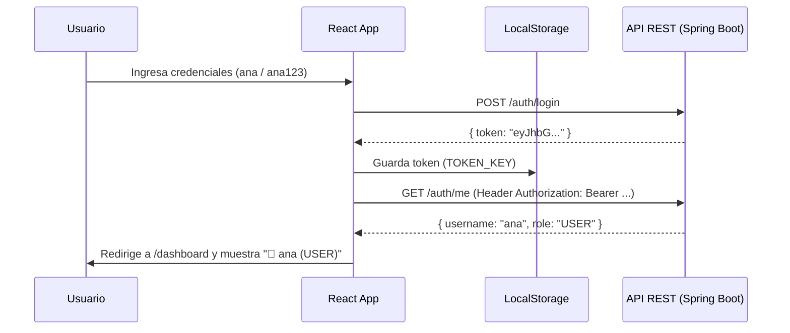

# TaskFlow - Gestor de Proyectos y Tareas con Autenticación JWT

Aplicación web frontend desarrollada en **React 19 + TypeScript + Vite + Material UI** que consume una API REST externa con seguridad basada en **JSON Web Tokens (JWT)**.

El proyecto permite gestionar el ciclo completo de vida de proyectos y tareas (CRUD), con autenticación de usuarios, protección de rutas en el cliente, validación en tiempo real y manejo de errores del backend.

---

## 🔑 Credenciales de Demo (Usuarios de Prueba)

Para probar la aplicación inmediatamente sin necesidad de registrarte, la API cuenta con los siguientes usuarios de demostración precargados:

| Usuario | Contraseña | Rol | Notas |
| :--- | :--- | :--- | :--- |
| **`ana`** | `ana123` | `USER` | Usuario regular de prueba |
| **`luis`** | `luis123` | `USER` | Usuario regular de prueba |
| **`admin`** | `admin123` | `ADMIN` | Permisos de administrador (puede eliminar cualquier proyecto) |

> **Nota:** También puedes registrar un usuario completamente nuevo desde la pantalla de **Registro** (`/register`).

---

## 🚀 ¿Qué problema resuelve el proyecto?
En entornos de trabajo colaborativo, los equipos necesitan organizar sus objetivos en proyectos estructurados y desglosarlos en tareas individuales con responsables, fechas de entrega y prioridades claras. 

**TaskFlow** resuelve esto proporcionando:
1. **Acceso seguro:** Registro e inicio de sesión con JWT para proteger la información.
2. **Organización jerárquica (1:N):** Proyectos que agrupan sus propias tareas.
3. **Flujo de trabajo ágil:** Cambio inmediato del estado de las tareas (`Por hacer` → `En progreso` → `Completada`).
4. **Reglas de negocio seguras:** Eliminación en cascada de proyectos y validación obligatoria de responsables asignados.

---

## 📂 Estructura de Carpetas y Organización del Código

El código fuente está organizado en `src/` bajo el principio de **separación de responsabilidades**:

```text
jwt-auth-demo/
├── .github/workflows/ci.yml   # Pipeline de integración y despliegue continuo (CI/CD)
├── public/                    # Archivos estáticos públicos
├── src/
│   ├── components/            # Piezas visuales reutilizables (UI)
│   ├── config/                # Variables de configuración (URL base de la API)
│   ├── context/               # Estado global de la aplicación (Autenticación)
│   ├── hooks/                 # Lógica desacoplada y estado de formularios / consultas
│   ├── pages/                 # Vistas completas asociadas a una ruta del navegador
│   ├── services/              # Capa de comunicación HTTP con la API (Axios)
│   ├── types/                 # Interfaces y contratos de TypeScript
│   ├── App.tsx                # Enrutador principal y configuración de temas
│   ├── main.tsx               # Punto de entrada de React al DOM
│   └── ProtectedRoute.tsx     # Guardián de rutas privadas
├── package.json               # Dependencias y scripts del proyecto
└── vite.config.ts             # Configuración del empaquetador Vite
```

### ¿Para qué sirve cada carpeta?

| Carpeta | ¿Qué contiene? | Para qué se usa |
| :--- | :--- | :--- |
| **`src/pages/`** | Vistas completas de la app (`LoginPage`, `RegisterPage`, `DashboardPage`, `TasksPage`, `TaskDetailPage`, `ProjectDetailPage`). | Cada archivo representa una **pantalla completa** vinculada a una URL en React Router. No contiene lógica compleja; orquesta los componentes hijos. |
| **`src/components/`** | Bloques de construcción visual (`Navbar`, `ProjectList`, `TaskList`, `TaskCardDetail`, `TaskFormDialog`, `TaskEditDialog`, `DashboardMetrics`). | Son componentes reutilizables. Reciben datos por `props` y emiten eventos hacia arriba. No saben cómo se consultan los datos del servidor. |
| **`src/services/`** | Capa de infraestructura de red (`httpClient.ts`, `authService.ts`, `projectService.ts`, `taskService.ts`). | Contiene las llamadas HTTP directas a los endpoints mediante Axios. Aquí vive el **interceptor** que inyecta automáticamente el token JWT y el interceptor de respuesta 401. |
| **`src/hooks/`** | Custom hooks (`useAuth`, `useTasks`, `useTaskForm`, `useUpdateTaskStatus`, `useDeleteTask`, `useProjects`, `useProjectTasks`, etc.). | Separan la lógica de la vista. Manejan estados como `loading`, `error`, datos en memoria y llamadas a los servicios. |
| **`src/context/`** | Contextos globales de React (`AuthContext.tsx`). | Evita el *prop drilling*. Comparte el estado del usuario autenticado (`user`, `isAuthenticated`, `loading`, `login`, `logout`) con toda la aplicación. |
| **`src/types/`** | Modelos de datos TypeScript (`auth.ts`, `project.ts`, `task.ts`, `index.ts`). | Define las interfaces y contratos de datos: cómo vienen las respuestas del backend y qué campos exige cada petición. |
| **`src/config/`** | Configuración de entorno (`apiUrl.ts`). | Centraliza la URL base de la API REST (`https://d3ujwk09smrk9z.cloudfront.net`) permitiendo cambiarla por variables de entorno. |

---

## 🌐 Endpoints de la API Consumidos

La aplicación implementa el consumo de los siguientes endpoints:

### 1. Autenticación (`/auth`)
- `POST /auth/register`: Registro de nuevos usuarios con validación de credenciales.
- `POST /auth/login`: Autenticación con usuario y contraseña; retorna el token JWT.
- `GET /auth/me`: Obtiene los datos del usuario logueado (`username`, `role`, `id`, `email`) a partir del JWT.

### 2. Tareas (`/tasks` y `/projects/{id}/tasks`)
- `GET /tasks`: Listado global de tareas.
- `GET /tasks/{id}`: Detalle completo de una tarea individual.
- `POST /projects/{projectId}/tasks`: Creación de una tarea asociada obligatoriamente a un proyecto y con responsable asignado.
- `PATCH /tasks/{id}/status`: Cambio rápido de estado (`TODO` → `IN_PROGRESS` → `DONE`). Valida la regla de negocio: si no tiene responsable, no se puede pasar a `DONE` (Error 422).
- `PUT /tasks/{id}`: Edición completa de la tarea (título, descripción, prioridad, fecha y responsable).
- `DELETE /tasks/{id}`: Eliminación física de una tarea con confirmación modal.

### 3. Proyectos (`/projects`)
- `GET /projects`: Lista todos los proyectos disponibles.
- `GET /projects/{id}`: Detalle individual de un proyecto.
- `GET /projects/{id}/tasks`: Tareas dedicadas de un proyecto específico directo del backend.
- `POST /projects`: Creación de proyecto (el `ownerId` se toma automáticamente del token JWT).
- `DELETE /projects/{id}`: Eliminación en cascada del proyecto y todas sus tareas (protegido: solo el owner o ADMIN tienen permisos; responde 403 si no estás autorizado).

---

## Decisiones de Alcance y Diseño

1. **Omisión intencional de `PUT /projects/{id}`:**  
   Por alcance de diseño, se decidió no implementar la edición de proyectos (`PUT /projects/{id}`) en esta versión. Se priorizó implementar el ciclo completo de CRUD sobre la entidad central de **Tareas** (con edición completa mediante `PUT /tasks/{id}` y cambio de estado con `PATCH /tasks/{id}/status`), mientras que para **Proyectos** se implementó su creación (`POST`), consulta global e individual (`GET`), consulta de tareas dedicadas (`GET /projects/{id}/tasks`) y su eliminación con regla de seguridad en cascada (`DELETE /projects/{id}`).

2. **Catálogo de Responsables (Assignees):**  
   La API REST oficial no expone un endpoint `GET /users` para listar a todos los usuarios registrados dinámicamente. Por este motivo, el selector de responsables muestra a los usuarios sembrados de la base de datos de demo (`Ana`, `Luis`, `Admin`) junto al usuario autenticado actual (`user.id`).

3. **Prevención de FOUC (Flash of Unauthenticated Content):**  
   Se implementó un estado reactivo `loading` en `AuthContext`. Mientras se valida el token existente en `localStorage` con `GET /auth/me`, `ProtectedRoute` muestra un spinner de pantalla completa, impidiendo que el Dashboard parpadee si el token guardado ha expirado o no es válido.

4. **Interceptor de Respuesta 401:**  
   En `httpClient.ts`, cualquier respuesta con código HTTP 401 limpia inmediatamente el token persistido y dispara un cierre de sesión automático y seguro.

---

## 🛡️ Flujo de Autenticación y Seguridad



- **Rutas Protegidas (`ProtectedRoute.tsx`):** Si un usuario no autenticado intenta ingresar a `/dashboard`, `/tasks` o `/projects/1`, es expulsado automáticamente a `/login`.
- **Persistencia de sesión:** Al recargar la página (`F5`), el `AuthContext` lee el token almacenado en `localStorage`, consulta `GET /auth/me` y mantiene la sesión abierta sin pedir contraseña nuevamente.

---

## 💻 Instalación y Ejecución Local

1. **Clonar el repositorio:**
   ```bash
   git clone https://github.com/<tu-usuario>/jwt-auth-demo.git
   cd jwt-auth-demo
   ```

2. **Instalar dependencias:**
   ```bash
   npm install
   ```

3. **Iniciar el servidor de desarrollo:**
   ```bash
   npm run dev
   ```
   Abre tu navegador en `http://localhost:5173/jwt-auth-demo/`.

4. **Compilar para producción:**
   ```bash
   npm run build
   ```

5. **Ejecutar el linter:**
   ```bash
   npm run lint
   ```

---

## ⚙️ Despliegue Continuo (CI/CD)

El proyecto cuenta con un flujo automatizado en **GitHub Actions** (`.github/workflows/ci.yml`):
- En cada `push` o `pull request` a la rama `main`:
  1. Descarga el código y configura Node.js 20.
  2. Instala dependencias limpias con `npm ci`.
  3. Valida tipos de TypeScript y compila el bundle de producción con Vite (`npm run build:pages`).
  4. Genera una copia de `index.html` como `404.html` para soportar el enrutamiento directo de React Router en GitHub Pages.
  5. Despliega automáticamente a **GitHub Pages**.
